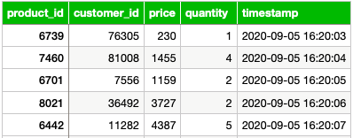

# MySQL Online Transactional Processing Database
> SoftCart were using MySQL for our online transactional processing, so, based on the sample data given, I was required to:
> - Design the database schema and create a database to store our sales data.
> - Create an index on the timestamp column.
> - Write an administrative bash script that exports sales data into a SQL file.


## Provided Scenario
You are a data engineer at an e-commerce company. Your company needs you to design a data platform that uses MySQL as an OLTP database. You will be using MySQL to store the OLTP data.

## Database Schema
<p align="center">
  
</p>

So, according to the provided sample data, the schema will contain the following columns:
- `product_id`
- `customer_id`
- `price`
- `quantity`
- `timestamp`

Sales data will be stored in a table named `sales_data` located in a database named `sales`.


## Exercise 01 : Design the OLTP Database

### Task 01 - Create a database
I used the following SQL statement to create our `sales` database.

```sql
CREATE DATABASE sales;
```

### Task 02 - Design a table named sales_data
I used the following statement to create `sales_data` table to store sales transactions.

```sql
CREATE TABLE `sales_data` (
	`product_id` INT NOT NULL,
	`customer_id` INT NOT NULL,
	`price` INT NOT NULL,
	`quantity` INT NOT NULL,
	`timestamp` TIMESTAMP NOT NULL ON UPDATE CURRENT_TIMESTAMP
);
```


## Exercise 02 : Load the Data

### Task 01 - Import the data in the file oltpdata.csv
After downloading the sample data prvided in the file `oltpdata.csv`, I imported it into `sales_data` using phpMyAdmin interface.
> ```
> Import has been successfully finished, 2605 queries executed. (oltpdata.csv)
> ```


### Task 02 - List the tables in the database sales

I used the MySQL CLI to list the tables in the sales database.

```sql
USE sales;
```
```sql
SHOW tables;
```
> ```
> +-----------------+
> | Tables_in_sales |
> +-----------------+
> | sales_data      |
> +-----------------+
> 1 row in set (0.01 sec)
> ```

### Task 03 - Write a query to find out the count of records in the tables sales_data

I wrote the following query to display the record count from `sales_data`.

```sql
SELECT COUNT(*)
FROM sales_data;
```
> ```
> +----------+
> | COUNT(*) |
> +----------+
> |     2605 |
> +----------+
> 1 row in set (0.00 sec)
> ```


## Exercise 03 : Set up Admin tasks

### Task 01 - Create an index

I needed to create an index named `ts` on the timestamp column.

```sql
CREATE INDEX ts ON sales_data (timestamp);
```
> ```
> Query OK, 0 rows affected (0.09 sec)
> Records: 0  Duplicates: 0  Warnings: 0
> ```

### Task 02 - List indexes

Using the following command, I will list all indexes from `sales_data` to confirm the creation of the `ts` index.

```sql
SHOW INDEX FROM sales_data;
```
> ```
> +------------+------------+----------+--------------+-------------+-----------+-------------+----------+--------+------+------------+---------+---------------+---------+------------+
> | Table      | Non_unique | Key_name | Seq_in_index | Column_name | Collation | Cardinality | Sub_part | Packed | Null | Index_type | Comment | Index_comment | Visible | Expression |
> +------------+------------+----------+--------------+-------------+-----------+-------------+----------+--------+------+------------+---------+---------------+---------+------------+
> | sales_data |          1 | ts       |            1 | timestamp   | A         |        2605 |     NULL |   NULL |      | BTREE      |         |               | YES     | NULL       |
> +------------+------------+----------+--------------+-------------+-----------+-------------+----------+--------+------+------------+---------+---------------+---------+------------+
> 1 row in set (0.00 sec)
> ```

Now, The timestamp index has been successfully created.

### Task 03 - Write a bash script to export data

I wrote a bash script `datadump.sh` that exports all records from `sales_data` into a SQL file named `sales_data.sql`.

Firstly, I created the file using the following command:
```console
sudo touch datadump.sh
```
Then, I opened the file in the nano editor:
```console
sudo nano datadump.sh
```
In the nano editor, I wrote the following bash script using `mysqldump` to export the records:
```console
#!/bin/bash
mysqldump -u root -p sales sales_data > sales_data.sql
```
Finally, After saving the file and exiting the editor, I needed to make the script executable:
```console
sudo chmod u+x datadump.sh
```

Now our `sales_data` export process can be executed with the following command:
```console
sudo ./datadump.sh
```


##

These were all exercises in the first module of the project.
Visit the socend module [here](https://github.com/Farahat612/SoftCart-Data-Platform---IBM-Capstone-Project/tree/main/02%20-%20MongoDB%20NoSQL%20Catalog%20Database).

