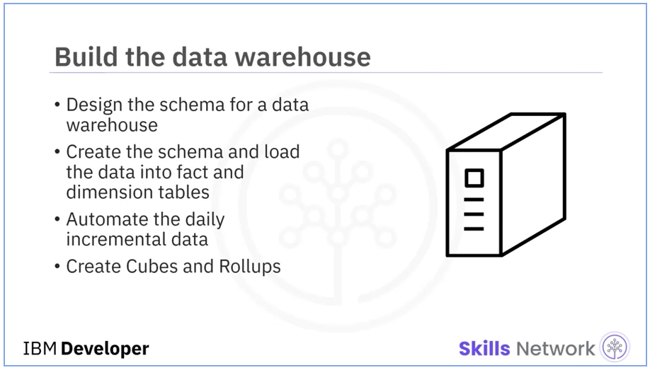

# PostgreSQL & IBM DB2 Data Warehouses
> Both Sales data from MySQL and catalog data from MongoDB were to be periodically extracted and stored into a staging data warehouse running on PostgreSQL, so I was required to:
> - Design a data warehouse star schema using the pgAdmin ERD design tool, ensuring that the table could generate yearly, monthly, daily, and weekly reports.
> - Export the schema SQL and create a staging database.
> - My Senior Data Engineer would then review my schema design, and perform any necessary adjustments before moving to the next phase.

<p align="center">
  
</p>


# PostgreSQL Staging Data Warehouse
> In this assignment you will:
> - Design a Data Warehouse using the pgAdmin ERD design tool.
> - Create the schema in the Data Warehouse.


## Provided Scenario
You are a data engineer hired by an ecommerce company named SoftCart.com . The company retails download only items like E-Books, Movies, Songs etc. The company has international presence and customers from all over the world. The company would like to create a data warehouse so that it can create reports like

- total sales per year per country
- total sales per month per category
- total sales per quarter per country
- total sales per category per country


## Data Warehouse Schema
<p align="center">
  
</p>


So, according to the provided sample order data and report requirements, the fact of measure has been constructed in the following table:
- `softcartFactSales`
   - <b>orderid</b> <sup><sub>PRIMARY KEY</sub></sup>
   - <b>dateid</b> <sup><sub>FOREIGN KEY</sub></sup>
   - <b>categoryid</b> <sup><sub>FOREIGN KEY</sub></sup>
   - <b>countryid</b> <sup><sub>FOREIGN KEY</sub></sup>
   - <b>itemid</b> <sup><sub>FOREIGN KEY</sub></sup>
   - <b>amount</b>

and contained the following dimensions:
- `softcartDimDate`
   - <b>dateid</b> <sup><sub>PRIMARY KEY</sub></sup>
   - <b>date</b>
   - <b>Year</b>
   - <b>Quarter</b>
   - <b>QuarterName</b>
   - <b>Month</b>
   - <b>MonthName</b>
   - <b>Day</b>
   - <b>Weekday</b>
   - <b>WeekdayName</b>
- `softcartDimCategory`
   - <b>categoryid</b> <sup><sub>PRIMARY KEY</sub></sup>
   - <b>category</b>
- `softcartDimCountry`
   - <b>countryid</b> <sup><sub>PRIMARY KEY</sub></sup>
   - <b>country</b>
- `softcartDimItem`
   - <b>itemid</b> <sup><sub>PRIMARY KEY</sub></sup>
   - <b>item</b>


## Exercise 01 : Design the Schema

I used pgAdmin's ERD Design Tool to create a temporary database `softcart` to design the star schema. Next, I created tables for each dimension/fact and design the relationships between them as follows:

<p align="center">
  
</p>


## Exercise 02 : Export the Schema
Then, I used the `export` feature in  pgAdmin's ERD Design Tool to export the following SQL code for creating the `staging` database:

```sql
-- This script was generated by a beta version of the ERD tool in pgAdmin 4.
-- Please log an issue at https://redmine.postgresql.org/projects/pgadmin4/issues/new if you find any bugs, including reproduction steps.
BEGIN;


CREATE TABLE public."DimCategory"
(
    categoryid smallint NOT NULL,
    category character varying(32)[] NOT NULL,
    PRIMARY KEY (categoryid)
);

CREATE TABLE public."DimCountry"
(
    countryid smallint NOT NULL,
    country character varying(32)[] NOT NULL,
    PRIMARY KEY (countryid)
);

CREATE TABLE public."DimDate"
(
    dateid smallint NOT NULL,
    date date NOT NULL,
    "Year" smallint NOT NULL,
    "Quarter" smallint NOT NULL,
    "QuarterName" character varying(2)[] NOT NULL,
    "Month" smallint NOT NULL,
    "Monthname" character varying(9)[] NOT NULL,
    "Day" smallint NOT NULL,
    "Weekday" smallint NOT NULL,
    "WeekdayName" character varying(9)[] NOT NULL,
    PRIMARY KEY (dateid)
);

CREATE TABLE public."FactSales"
(
    orderid bigint NOT NULL,
    dateid smallint NOT NULL,
    countryid smallint NOT NULL,
    categoryid smallint NOT NULL,
    amount bigint NOT NULL,
    PRIMARY KEY (orderid)
);

ALTER TABLE public."FactSales"
    ADD FOREIGN KEY (dateid)
    REFERENCES public."DimDate" (dateid)
    NOT VALID;


ALTER TABLE public."FactSales"
    ADD FOREIGN KEY (countryid)
    REFERENCES public."DimCountry" (countryid)
    NOT VALID;


ALTER TABLE public."FactSales"
    ADD FOREIGN KEY (categoryid)
    REFERENCES public."DimCategory" (categoryid)
    NOT VALID;

END;
```

```shell
COMMIT

Query returned successfully in 1 secs 672 msec.
```


# IBM DB2 Production Data Warehouse

> In this assignment you will:
> - Load data into Data Warehouse.
> - Write aggregation queries.
> - Create MQTs.
> So, using the adjusted schema design, I created an instance of IBM DB2 and loaded the sample datasets into their respective tables, wrote aggregation queries and created a Materialized Query Table for future reports.


## Provided Scenario
You are a data engineer hired by an ecommerce company named SoftCart.com . The company retails download only items like E-Books, Movies, Songs etc. The company has international presence and customers from all over the world. You have designed the schema for the data warehouse in the previous assignment. Data engineering is a team game. Your senior data engineer reviewed your design. Your schema design was improvised to suit the production needs of the company. In this assignment you will generate reports out of the data in the data warehouse.


## Exercise 01 : Prepare an Instance of IBM DB2

I started by creating the following tables and loaded their respective datasets [avaiable in datasets directory].
- `DimDate`
- `DimCategory`
- `DimCountry`
- `FactSales`

Now, I have the IBM DB2 Instance ready for required aggregation queries.


## Exercise 02 : Aggregation Queries for Data Analytics

### Task 01 - Create a grouping sets query
Create a `GROUPING SETS` query using the columns `country`, `category`, and `totalsales`.

```sql
SELECT
	category,
	country,
	sum(amount) as totalsales

FROM
	factsales as sales
	
INNER JOIN dimcategory as cat
	ON cat.categoryid = sales.categoryid

INNER JOIN dimcountry as country
	ON country.countryid = sales.countryid

GROUP BY
	GROUPING SETS (
		(cat.category, country.country),
		(cat.category),
		(country.country),
		()
	)

ORDER BY
	country.country
```
Sample output (first 10 rows).
> | CATEGORY    | COUNTRY              | TOTALSALES |
> |-------------|----------------------|------------|
> |             | Argentina            | 21755581   |
> | Books       | Argentina            | 4285010    |
> | Electronics | Argentina            | 4338757    |
> | Software    | Argentina            | 4292153    |
> | Sports      | Argentina            | 4450354    |
> | Toys        | Argentina            | 4389307    |
> |             | Australia            | 21522004   |
> | Books       | Australia            | 4340188    |
> | Electronics | Australia            | 4194740    |
> | Software    | Australia            | 4410360    |


### Task 02 - Create a rollup query
Create a `ROLLUP` query using the columns `year`, `country`, and `totalsales`.

```sql
SELECT
	year,
	country,
	sum(amount) as totalsales

FROM
	factsales as sales
	
INNER JOIN dimdate
	ON dimdate.dateid = sales.dateid

INNER JOIN dimcountry as country
	ON country.countryid = sales.countryid

GROUP BY
	ROLLUP (
		dimdate.year,
		country.country
	)

ORDER BY
	dimdate.year
```
Sample output (first 10 rows).

> | YEAR | COUNTRY              | TOTALSALES |
> |------|----------------------|------------|
> | 2019 |                      | 399729036  |
> | 2019 | Argentina            | 7163167    |
> | 2019 | Australia            | 7259016    |
> | 2019 | Austria              | 7320233    |
> | 2019 | Azerbaijan           | 7097729    |
> | 2019 | Belgium              | 7093441    |
> | 2019 | Brazil               | 7116253    |
> | 2019 | Bulgaria             | 7312912    |
> | 2019 | Canada               | 7158271    |
> | 2019 | Cyprus               | 7250287    |


### Task 03 - Create a cube query
Create a `CUBE` query using the columns `year`, `country`, and `averagesales`.

```sql
SELECT
	year,
	country,
	avg(amount) as averagesales

FROM
	factsales as sales
	
INNER JOIN dimdate
	ON dimdate.dateid = sales.dateid

INNER JOIN dimcountry as country
	ON country.countryid = sales.countryid

GROUP BY
	CUBE (
		dimdate.year,
		country.country
	)

ORDER BY
	dimdate.year,
	country.country
```

Sample output (first 10 rows).
> | YEAR | COUNTRY              | AVERAGESALES |
> |------|----------------------|--------------|
> | 2019 | Argentina            | 4017         |
> | 2019 | Australia            | 4066         |
> | 2019 | Austria              | 4078         |
> | 2019 | Azerbaijan           | 3967         |
> | 2019 | Belgium              | 3978         |
> | 2019 | Brazil               | 4025         |
> | 2019 | Bulgaria             | 4087         |
> | 2019 | Canada               | 4005         |
> | 2019 | Cyprus               | 4045         |
> | 2019 | Czech Republic       | 3979         |


## Exercise 03 : Materialized Query Table (MQT)

Create an MQT named `total_sales_per_country` based on the columns `country` and `totalsales`.

```sql
CREATE TABLE total_sales_per_country (total_sales, country) AS (
    SELECT sum(amount), country
    FROM FactSales
    LEFT JOIN DimCountry
    ON FactSales.countryid = DimCountry.countryid
    GROUP BY (), country
)
DATA INITIALLY DEFERRED
REFRESH DEFERRED
MAINTAINED BY SYSTEM;
```

That MQT had not contain any data initially due to the configurations `DATA INITIALLY DEFERRED` and `REFRESH DEFERRED`.
So, to populate it, I had to run `REFRESH TABLE` SQL statement, and then display the content of the table as follows:

```sql
REFRESH TABLE total_sales_per_country;
SELECT * FROM total_sales_per_country;
```

Sample output (first 15 rows).

> | TOTAL_SALES | COUNTRY              |
> |-------------|----------------------|
> | 21755581    | Argentina            |
> | 21522004    | Australia            |
> | 21365726    | Austria              |
> | 21325766    | Azerbaijan           |
> | 21498249    | Belgium              |
> | 21350771    | Brazil               |
> | 21410716    | Bulgaria             |
> | 21575438    | Canada               |
> | 21500526    | Cyprus               |
> | 21334142    | Czech Republic       |
> | 21331097    | Denmark              |
> | 21379967    | Egypt                |
> | 21493054    | Estonia              |
> | 21336188    | Finland              |
> | 21341055    | France               |


## View Fourth Task

These were all exercises in the third module of the project.
Visit the next module [here](https://github.com/Farahat612/SoftCart-Data-Platform---IBM-Capstone-Project/tree/main/04%20-%20IBM%20Cognos%20BI%20Analytics%20Dashboard).


