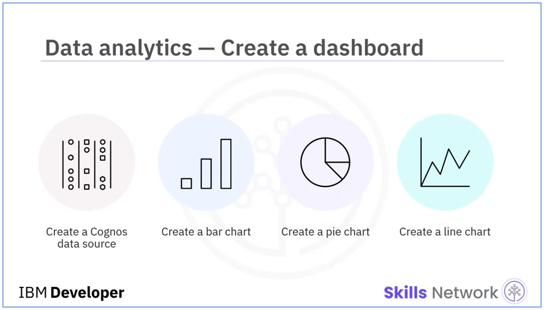
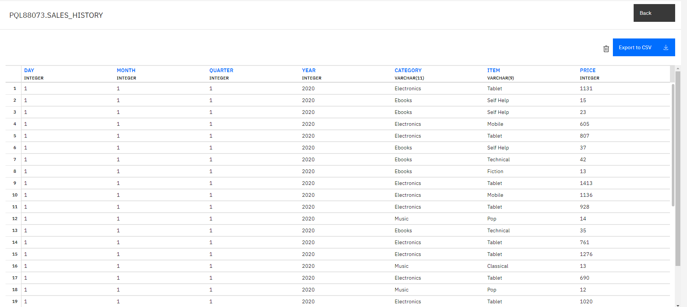
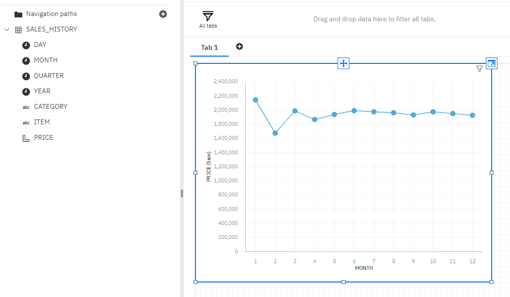
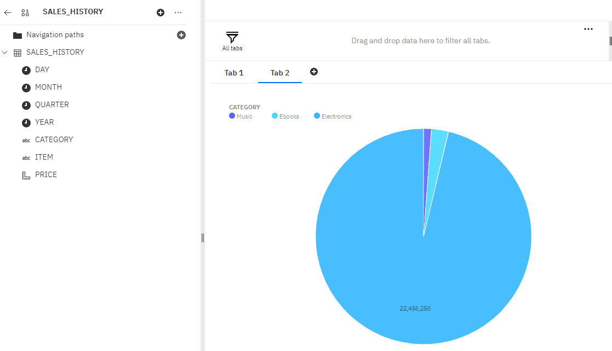
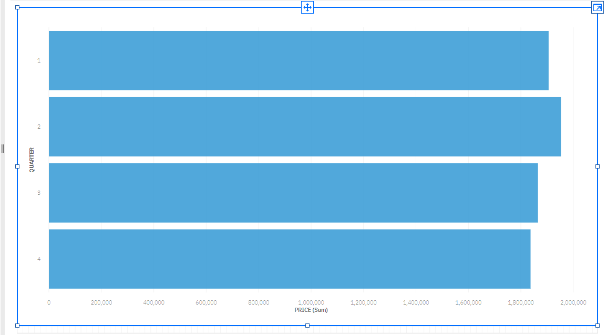

# IBM Cognos BI Analytics Dashboard
> The data from the previous stage would be transformed and loaded into a production data warehouse running on IBM Db2 to be connected to IBM Cognos Analytics as a data source to generate reports and charts as follows:
>
> - A line chart of month wise total sales for the year 2020
> - A pie chart of category wise total sales
> - A bar chart of Quarterly sales of mobile phones

  

## Provided Scenario
You are a data engineer at an e-commerce company. Your company has finished setting up a data warehouse. Now you are assigned the responsibility to design a reporting dashboard that reflects the key metrics of the business.

## Exercise 01 : Load data into the data warehouse
I imported the data from the downloaded file `ecommerce.csv` into a table named `sales_history`and connected it as a data source to IBM Cognos Analytics.

> 

>   
> 

## Exercise 02 : Create a dashboard

### Task 01 - Create a line chart
Create a line chart of month wise total sales for the year 2020.

> 

>   
> 

### Task 02 - Create a pie chart
Create a pie chart of category wise total sales.

> 

>   
> 

### Task 03 - Create a bar chart
Create a bar chart of Quarterly sales of mobile phones.

> 

>   
> 

## View Fifth Module

These were all exercises in this module of the project.
Visit the next module [here](https://github.com/Farahat612/SoftCart-Data-Platform---IBM-Capstone-Project/tree/main/05%20-%20ETL%20%26%20Data%20Pipelines).

