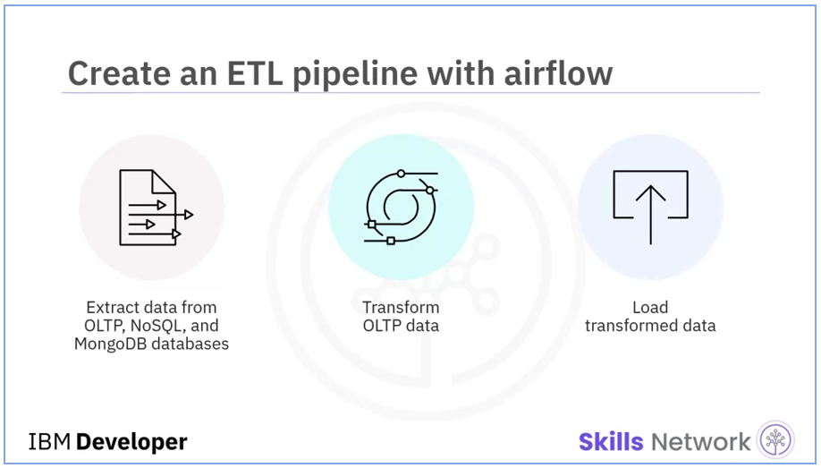

# ETL & Data Pipelines
> 1. Python Scripts & Automation:
> > SoftCart needed to keep data synchronized between different databases and data warehouses as a part of their daily routine. > So, one task that was routinely performed was syncing of staging data warehouse and production data warehouse.
> > So, I was required to write a script that will automate the process of regularly updating the DB2 instance with new records from MySQL.
> 
> 2. Apache Airflow ETL & Data Pipelines:
> > SoftCart has imported web server log files as `accesslog.txt`.
> > So, I was required to write an Airflow DAG pipeline that analyzes the log files, extracts the required lines and fields, transforms and loads the data to an existing file.

<p align="center">
  
</p>


# Python Scripts & Automation
> In this assignment you will write a python program that will:
> 
> - Connect to IBM DB2 or PostgreSQL data warehouse and identify the last row on it.
> - Connect to MySQL staging data warehouse and find all rows later than the last row on the datawarehouse.
> - Insert the new data in the MySQL staging data warehouse into the IBM DB2 or PostgreSQL production data warehouse.


## Provided Scenario
You are a data engineer at an e-commerce company. You need to keep data synchronized between different databases/data warehouses as a part of your daily routine. One task that is routinely performed is the sync up of staging data warehouse and production data warehouse. Automating this sync up will save you a lot of time and standardize your process. You will be given a set of python scripts to start with. You will use/modify them to perform the incremental data load from MySQL server which acts as a staging warehouse to the IBM DB2 or PostgreSQL which is a production data warehouse. This script will be scheduled by the data engineers to sync up the data between the staging and production data warehouse.


## Exercise 01 : Preparing The Environment

### Task 01 - Connecting to MySQL Database with Python
Firstly I installed the `mysql-connector-python` dependency using pip.

```console
python3 -m pip install mysql-connector-python==8.0.31
```
> ```
> Successfully installed mysql-connector-python-8.0.31 protobuf-3.19.6
> ```

Then to connect to the MySQL database `sales` using Python, I created a new file `mysqlconnect.py`. The main script was provided, I just needed to modify the credentials to connect to my database. The script does the following:
- Use `mysql.connector` to connect to the database `sales`
- Create a table for `products`
- Insert product data
- Output the table records for confirmation

```python
# This program requires the python module mysql-connector-python to be installed.
# Install it using the below command
# pip3 install mysql-connector-python

import mysql.connector

# connect to database
connection = mysql.connector.connect(user='root', password='OTczNy1tb2hhbWVk',host='127.0.0.1',database='sales')

# create cursor

cursor = connection.cursor()

# create table

SQL = """CREATE TABLE IF NOT EXISTS products(

rowid int(11) NOT NULL AUTO_INCREMENT PRIMARY KEY,
product varchar(255) NOT NULL,
category varchar(255) NOT NULL

)"""

cursor.execute(SQL)

print("Table created")

# insert data

SQL = """INSERT INTO products(product,category)
	 VALUES
	 ("Television","Electronics"),
	 ("Laptop","Electronics"),
	 ("Mobile","Electronics")
	 """

cursor.execute(SQL)
connection.commit()


# query data

SQL = "SELECT * FROM products"

cursor.execute(SQL)

for row in cursor.fetchall():
	print(row)

# close connection
connection.close()

```

Then, I ran the script as follows:

```console
python3 mysqlconnect.py
```

> ```
> Table created
> (1, 'Television', 'Electronics')
> (2, 'Laptop', 'Electronics')
> (3, 'Mobile', 'Electronics')
> ```


### Task 02 - Connecting to IBM DB2 with Python

Firstly, I installed the `ibm-db` dependency using pip as follows:

```console
python3 -m pip install ibm-db
```
> ```
> Successfully installed ibm-db-3.1.4
> ```

Then, I created a new file `db2connect.py` containing the script provided. The main script was provided as well and I just needed to modify the credentials to connect to my IBM DB2 instance. The script does the following:
- Use `ibm_db` to connect to our IBM DB2 instance
- Create a table for `products`
- Insert product data
- Output the table records for confirmation


```python
# This program requires the python module ibm-db to be installed.
# Install it using the below command
# python3 -m pip install ibm-db

import ibm_db

# connectction details

dsn_hostname = "ba99a9e6-d59e-4883-8fc0-d6a8c9f7a08f.c1ogj3sd0tgtu0lqde00.databases.appdomain.cloud" # e.g.: "dashdb-txn-sbox-yp-dal09-04.services.dal.bluemix.net"
dsn_uid = "pql88073"        # e.g. "abc12345"
dsn_pwd = "1gJmyQwxMGqqc0G9"      # e.g. "7dBZ3wWt9XN6$o0J"
dsn_port = "31321"                # e.g. "50000" 
dsn_database = "bludb"            # i.e. "BLUDB"
dsn_driver = "{IBM DB2 ODBC DRIVER}" # i.e. "{IBM DB2 ODBC DRIVER}"           
dsn_protocol = "TCPIP"            # i.e. "TCPIP"
dsn_security = "SSL"              # i.e. "SSL"

#Create the dsn connection string
dsn = (
    "DRIVER={0};"
    "DATABASE={1};"
    "HOSTNAME={2};"
    "PORT={3};"
    "PROTOCOL={4};"
    "UID={5};"
    "PWD={6};"
    "SECURITY={7};").format(dsn_driver, dsn_database, dsn_hostname, dsn_port, dsn_protocol, dsn_uid, dsn_pwd, dsn_security)

# create connection
conn = ibm_db.connect(dsn, "", "")
print ("Connected to database: ", dsn_database, "as user: ", dsn_uid, "on host: ", dsn_hostname)

# create table
SQL = """CREATE TABLE IF NOT EXISTS products(rowid INTEGER PRIMARY KEY NOT NULL,product varchar(255) NOT NULL,category varchar(255) NOT NULL)"""

create_table = ibm_db.exec_immediate(conn, SQL)


print("Table created")

# insert data

SQL = "INSERT INTO products(rowid,product,category)  VALUES(?,?,?);"
stmt = ibm_db.prepare(conn, SQL)
row1 = (1,'Television','Electronics')
ibm_db.execute(stmt, row1)

row2 = (2,'Laptop','Electronics')
ibm_db.execute(stmt, row2)

row3 = (3,'Mobile','Electronics')
ibm_db.execute(stmt, row3)


# query data

SQL="SELECT * FROM products"
stmt = ibm_db.exec_immediate(conn, SQL)
tuple = ibm_db.fetch_tuple(stmt)
while tuple != False:
    print (tuple)
    tuple = ibm_db.fetch_tuple(stmt)
# export the fields name and type from collection test into the file data.csv


# close connection
ibm_db.close(conn)

```

Then, I ran the script as follows:

```console
python3 db2connect.py
```

> ```
> Connected to database:  bludb as user:  pql88073 on host:  ba99a9e6-d59e-4883-8fc0-d6a8c9f7a08f.c1ogj3sd0tgtu0lqde00.databases.appdomain.cloud
> Table created
> (1, 'Television', 'Electronics')
> (2, 'Laptop', 'Electronics')
> (3, 'Mobile', 'Electronics')
> ```


### Task 03 - Creating The Database Table
Create a table called `sales_data` using the columns `rowid`, `product_id`, `customer_id`, `price`, `quantity`, `timestamp`.
Load `sales.csv` into the table `sales_data` on your PostgreSql database.

I created the table using the following `sql` commands:
```sql
CREATE TABLE `sales_data` (
  rowid INT NOT NULL,
  product_id INT NOT NULL,
  customer_id INT NOT NULL,
  quantity INT NOT NULL,
  price DOUBLE NOT NULL DEFAULT 0,
  timestamp TIMESTAMP NOT NULL DEFAULT CURRENT_TIMESTAMP,  
) ;

```
Then, I loaded the data from `sales.csv` into the table `sales_data`.


## Exercise 02 : Automating Loading Of Incremental Data Into The Data Warehouse
I wrote a script `automation.py` that does the following:
- Use `mysql.connector` and `ibm_db` to connect to MySQL and IBM DB2 respectively
- Return the `rowid` value of the last column in DB2 as `last_row_id`
- Return a list of all records from MySQL whose `rowid` is greater than `last_row_id` as `new_records`
- Insert `new_records` into the DB2 instance

```python
# Import libraries required for connecting to mysql
import mysql.connector
# Import libraries required for connecting to DB2 or PostgreSql
import ibm_db
# Connect to MySQL
connection = mysql.connector.connect(user='root', password='OTczNy1tb2hhbWVk',host='127.0.0.1',database='sales')
cursor = connection.cursor()
# Connect to DB2 or PostgreSql
dsn_hostname = "ba99a9e6-d59e-4883-8fc0-d6a8c9f7a08f.c1ogj3sd0tgtu0lqde00.databases.appdomain.cloud" # e.g.: "dashdb-txn-sbox-yp-dal09-04.services.dal.bluemix.net"
dsn_uid = "pql88073"        # e.g. "abc12345"
dsn_pwd = "1gJmyQwxMGqqc0G9"      # e.g. "7dBZ3wWt9XN6$o0J"
dsn_port = "31321"                # e.g. "50000" 
dsn_database = "bludb"            # i.e. "BLUDB"
dsn_driver = "{IBM DB2 ODBC DRIVER}" # i.e. "{IBM DB2 ODBC DRIVER}"           
dsn_protocol = "TCPIP"            # i.e. "TCPIP"
dsn_security = "SSL"              # i.e. "SSL"


dsn = (
    "DRIVER={0};"
    "DATABASE={1};"
    "HOSTNAME={2};"
    "PORT={3};"
    "PROTOCOL={4};"
    "UID={5};"
    "PWD={6};"
    "SECURITY={7};").format(dsn_driver, dsn_database, dsn_hostname, dsn_port, dsn_protocol, dsn_uid, dsn_pwd, dsn_security)


conn = ibm_db.connect(dsn, "", "")
print ("Connected to database: ", dsn_database, "as user: ", dsn_uid, "on host: ", dsn_hostname)

# Find out the last rowid from DB2 data warehouse or PostgreSql data warehouse
# The function get_last_rowid must return the last rowid of the table sales_data on the IBM DB2 database or PostgreSql.

def get_last_rowid():
    last_rowid_sql = 'SELECT rowid FROM sales_data ORDER BY rowid DESC LIMIT 1'
    last_rowid_stmt = ibm_db.exec_immediate(conn, last_rowid_sql)
    while ibm_db.fetch_row(last_rowid_stmt) != False:
        return ibm_db.result(last_rowid_stmt, 0)

last_row_id = get_last_rowid()
print("Last row id on production datawarehouse = ", last_row_id)

# List out all records in MySQL database with rowid greater than the one on the Data warehouse
# The function get_latest_records must return a list of all records that have a rowid greater than the last_row_id in the sales_data table in the sales database on the MySQL staging data warehouse.

def get_latest_records(rowid):
    latest_records_sql = f'SELECT * FROM sales_data WHERE rowid > {last_row_id} ORDER BY rowid ASC'
    cursor.execute(latest_records_sql)
    return cursor.fetchall()	

new_records = get_latest_records(last_row_id)

print("New rows on staging datawarehouse = ", len(new_records))

# Insert the additional records from MySQL into DB2 or PostgreSql data warehouse.
# The function insert_records must insert all the records passed to it into the sales_data table in IBM DB2 database or PostgreSql.

def insert_records(records):
    insert_sql = "INSERT INTO sales_data (rowid, product_id, customer_id, quantity) VALUES (?,?,?,?);"
    insert_stmt = ibm_db.prepare(conn, insert_sql)
    for row in records:
        ibm_db.execute(insert_stmt, row)


insert_records(new_records)
print("New rows inserted into production datawarehouse = ", len(new_records))

# disconnect from mysql warehouse
connection.close()
# disconnect from DB2 or PostgreSql data warehouse 
ibm_db.close(conn)
# End of program
```

Then I tested the data synchronization by running the script as following:
```console
python3 automation.py
```
> ```
> Connected to database:  bludb as user:  pql88073 on host:  ba99a9e6-d59e-4883-8fc0-d6a8c9f7a08f.c1ogj3sd0tgtu0lqde00.databases.appdomain.cloud
> Last row id on production datawarehouse =  12289
> New rows on staging datawarehouse =  1650
> New rows inserted into production datawarehouse =  1650
> ```

Hence, our automation script workedsuccessfully, let's go to the second part of the module.


# Apache Airflow ETL & Data Pipelines
> In this assignment you will author an Apache Airflow DAG that will:
> 
> - Extract data from a web server log file.
> - Transform the data.
> - Load the transformed data into a tar file.


## Provided Scenario
Write a pipeline that analyzes the web server log file, extracts the required lines (ending with `html`) and fields (`time stamp`, `size` ) and transforms (`bytes` to `mb`) and load (append to an existing file.)


