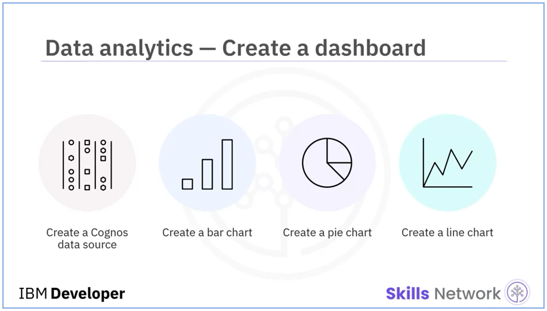

# SoftCard's Data Platform --- IBM Data Engineering Capstone Project
Capstone project for the IBM Data Engineering Professional Certificate program, offered by IBM Skills Network and hosted on Coursera.

## Overview
In this project, I was required to assume the role of an Associate Data Engineer who has recently joined a fictional online e-Commerce company named SoftCart. I was presented with real-world use cases that required me to apply a number of industry standard data engineering solutions.

## Data Platform Architecture

  

## Objectives
- Showcase adeptness in the essential skills for an entry-level data engineering role
- Demonstrate practical knowledge of relational databases, NoSQL data stores, big data engines, data warehouses, and data pipelines
- Utilize Linux shell scripting, SQL, and Python programming languages to address Data Engineering challenges
- Develop and execute different concepts and elements throughout the data engineering lifecycle

## Project Process and outline
- SoftCart's online presence is primarily through its website, which customers access using a variety of devices like laptops, mobiles and tablets.
- All the catalog data of the products is stored in the MongoDB NoSQL server.
- All the transactional data like inventory and sales are stored in the MySQL database server.
- SoftCart's webserver is driven entirely by these two databases.
- Data is periodically extracted from these two databases and put into the staging data warehouse running on PostgreSQL.
- Production data warehouse is on the cloud instance of IBM DB2 server.
- BI teams connect to the IBM DB2 for operational dashboard creation. IBM Cognos Analytics is used to create dashboards.
- SoftCart uses Hadoop cluster as it big data platform where all the data collected for analytics purposes.
- Spark is used to analyse the data on the Hadoop cluster.
- To move data between OLTP, NoSQL and the dataware house ETL pipelines are used and these run on Apache Airflow.

## Tools/Software
- **OLTP Database** - MySQL
- **NoSql Database** - MongoDB
- **Production Data Warehouse** – DB2 on Cloud
- **Staging Data Warehouse** – PostgreSQL
- **Big Data Platform** - Hadoop
- **Big Data Analytics Platform** – Spark
- **Business Intelligence Dashboard** - IBM Cognos Analytics
- **Data Pipelines** - Apache Airflow

## Project tasks

  

### 1. MySQL Online Transactional Processing Database

  

SoftCart were using MySQL for our online transactional processing, so, based on the sample data given, I was required to:
- Design the database schema and create a database to store our sales data.
- Create an index on the timestamp column.
- Write an administrative bash script that exports sales data into a SQL file.

### 2. MongoDB NoSQL Catalog Database

  

All of SoftCart's catalog data was to be stored on a MongoDB NoSQL server, so I was required to:
- Create the database `catalog` and import their electronics products from `catalog.json` into a collection named `electronics`.
- Run test queries against the data and export the collection into a file named `electronics.csv` using only the `_id`, `type`, and `model` fields.

### 3. PostgreSQL Staging Data Warehouse

  

Both Sales data from MySQL and catalog data from MongoDB were to be periodically extracted and stored into a staging data warehouse running on PostgreSQL, so I was required to:
- Design a data warehouse star schema using the pgAdmin ERD design tool, ensuring that the table could generate yearly, monthly, daily, and weekly reports.
- Export the schema SQL and create a staging database.
- My Senior Data Engineer would then review my schema design, and perform any necessary adjustments before moving to the next phase.

### 4. IBM Cognos BI Analytics Dashboard

  

The data from the previous stage would be transformed and loaded into a production data warehouse running on IBM Db2 to be connected to IBM Cognos Analytics as a data source to generate reports and charts as follows:
- A line chart of month wise total sales for the year 2020
- A pie chart of category wise total sales
- A bar chart of Quarterly sales of mobile phones

### 5. ETL & Data Pipelines

  

1. Python Scripts & Automation.
SoftCart needed to keep data synchronized between different databases and data warehouses as a part of their daily routine. So, one task that was routinely performed was syncing of staging data warehouse and production data warehouse.
So, I was required to write a script that will automate the process of regularly updating the DB2 instance with new records from MySQL.

2. Apache Airflow ETL & Data Pipelines
SoftCart has imported web server log files as `accesslog.txt`.
So, I was required to write an Airflow DAG pipeline that analyzes the log files, extracts the required lines and fields, transforms and loads the data to an existing file.

### 6. Apache Spark Big Data Analytics

  

The team has prepared a set of data containing search terms on their e-Commerce platform. So, I was required to:
- Download the data and run analytic queries on it using `pyspark` and `JupyterLab`.
- Use a pretrained sales forecasting model to predict the sales for 2023.

## View First Task

Visit the first module [here](https://github.com/Farahat612/SoftCart-Data-Platform---IBM-Capstone-Project/tree/main/01%20-%20MySQL%20Online%20Transactional%20Processing%20Database).

## Known Issues or Limitations

Currently, there are no known issues or limitations with this project.

## Acknowledgments

This project was completed as capstone project for `IBM Data Engineer` Professional Certificate on Coursera.
Each directory represents a project task, inside each one, you will find all task information, files and code solutions.

## License

This project is licensed under the [MIT License](LICENSE).

